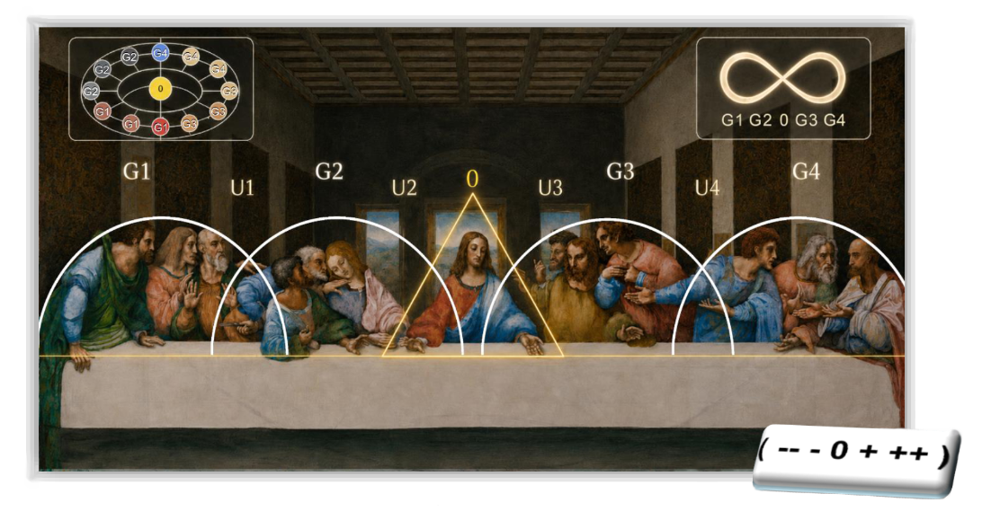

# The Last Supper Leonardo da Vincis

Eine interpretative Abhandlung über Struktur, Spannung und archetypische Ordnung



## 1. Einleitung

Das Wandgemälde The Last Supper zählt zu den bekanntesten Kunstwerken der Renaissance. Es zeigt die biblische Szene des letzten Abendmahls, in der Jesus seinen Jüngern mitteilt, dass einer von ihnen ihn verraten wird.

Neben der religiösen Bedeutung fällt jedoch eine außergewöhnlich klare strukturelle Ordnung der Komposition auf. Figuren, Gesten, Blickrichtungen und räumliche Anordnung bilden ein auffällig kohärentes System.

Die vorliegende Arbeit versteht sich nicht als Rekonstruktion der Absichten Leonardo da Vincis, sondern als interpretative Analyse der im Bild erkennbaren Strukturen. Ausgangspunkt ist die Beobachtung, dass das Gemälde eine präzise organisierte räumliche und emotionale Dynamik zeigt.

Diese Dynamik lässt sich modellhaft beschreiben.

In dieser Abhandlung wird daher die Hypothese entwickelt, dass die Komposition des Bildes als strukturelles Modell eines Spannungsfeldes gelesen werden kann.

Dieses Spannungsfeld kann auf zwei Ebenen interpretiert werden:

1. als psychologisches bzw. neurologisches Modell menschlicher Reaktionsmuster,
2. als abstraktes physikalisches Modell eines Systems mit einem stabilen Nullpunkt und Spannungsgradienten.

Diese Interpretation versteht das Bild daher nicht nur als narrative Darstellung, sondern als strukturierte Darstellung eines Systems von Beziehungen und Spannungen.

## 2. Historischer Kontext

### 2.1 Renaissance und strukturelle Harmonie

Die Kunst der Renaissance war stark von mathematischer Ordnung, Proportion und Geometrie geprägt. Künstler beschäftigten sich intensiv mit Perspektive, Proportion und der strukturellen Organisation von Bildern.

In diesem kulturellen Kontext entstanden Werke, die nicht nur narrative Inhalte transportieren, sondern gleichzeitig geometrische und proportionale Ordnungsprinzipien sichtbar machen.

Das Abendmahl ist ein Beispiel für eine Komposition, in der solche Ordnungsprinzipien besonders deutlich hervortreten.

### 2.2 Das Abendmahl als strukturierte Szene

Die Figuren im Bild sind klar gegliedert:

- vier Gruppen von jeweils drei Aposteln
- eine zentrale Figur

Die Struktur lässt sich daher darstellen als:

```text
3 + 3 + 1 + 3 + 3
```

Die zentrale Figur bildet gleichzeitig:

- den geometrischen Mittelpunkt der Perspektive
- den visuellen Ruhepunkt
- den kommunikativen Mittelpunkt der Szene

Diese besondere Position macht das Zentrum der Komposition zu einem natürlichen Bezugspunkt für strukturelle Interpretationen.

## 3. Methodische Grundlage der Interpretation

Die folgende Analyse basiert auf einer interdisziplinären Betrachtung, die Elemente aus verschiedenen Bereichen zusammenführt:

- Kompositionsanalyse der Kunstgeschichte
- Systemtheorie
- Gruppendynamik
- archetypische Psychologie
- Modelle physikalischer Spannungsfelder

Die hier entwickelte Interpretation versteht das Bild daher als Systemdarstellung, in der Figuren, Gesten und räumliche Anordnung als Komponenten eines strukturierten Feldes gelesen werden können.

Wichtig ist dabei:

Diese Deutung erhebt keinen Anspruch darauf, Leonardos tatsächliche Intention zu rekonstruieren, sondern beschreibt lediglich eine mögliche strukturelle Lesart der Bildkomposition.

## 4. Die Komposition als strukturelles System

### 4.1 Das Zentrum als Nullpunkt

Die zentrale Figur Jesu bildet den stabilsten Punkt des Bildes.

Mehrere Merkmale konzentrieren sich hier:

- Perspektivischer Fluchtpunkt
- visuelle Ruhe
- symmetrische Einbettung in die Komposition
- vergleichsweise geringe Gestenbewegung

In der hier vorgeschlagenen Interpretation kann diese Position als Nullpunkt eines Spannungsfeldes verstanden werden.

```text
0
```

Der Nullpunkt steht dabei für einen Zustand minimaler Reaktion innerhalb eines Systems, während sich die Reaktionen der Umgebung stärker ausprägen.

### 4.2 Die Apostel als Reaktionsfelder

Die Apostel reagieren sichtbar auf die Aussage Jesu über den Verrat.

Ihre Gesten zeigen unterschiedliche emotionale Zustände, darunter:

- Überraschung
- Empörung
- Zweifel
- Verteidigung
- Nachfrage
- Rückzug

Diese Reaktionen sind in Gruppen organisiert. Jede Dreiergruppe bildet eine lokale Reaktionseinheit innerhalb der Szene.

Die Komposition kann daher als Abfolge von Spannungsstufen interpretiert werden:

```text
− − − 0 + + +
```

Diese Skala beschreibt keine moralische Bewertung, sondern unterschiedliche Intensitäten der Reaktion.

## 5. Polarität der Gestik der zentralen Figur

Besonders auffällig ist die Gestik der Arme der zentralen Figur.

Wichtig ist dabei eine präzise Beschreibung der Perspektive.

Die Gesten sollten nicht relativ zum Betrachter, sondern relativ zur Figur selbst beschrieben werden.

Aus Sicht der dargestellten Figur gilt daher:

- linke Hand Jesu wirkt offen und aufnehmend
- rechte Hand Jesu wirkt begrenzend oder mahnend

Wird das Bild aus der Perspektive des Betrachters beschrieben, erscheint diese Zuordnung umgekehrt. Für eine strukturelle Analyse ist jedoch die Orientierung aus Sicht der Figur selbst präziser.

Die Gestik erzeugt damit eine Polarität innerhalb des Zentrums:

```text
offen ← 0 → begrenzend
```

Der Mittelpunkt fungiert in dieser Interpretation als vermittelnde Instanz zwischen zwei Polen eines Spannungsfeldes.

## 6. Gruppenstruktur und Bogenfelder

Die Köpfe der Apostel sowie ihre Gesten lassen sich visuell in bogenförmigen Gruppenstrukturen wahrnehmen.

Diese Bögen können als Felder lokaler Interaktion interpretiert werden.

```text
(G1) (G2) 0 (G3) (G4)
 ∩    ∩   ▲   ∩    ∩
```

Zwischen diesen Feldern entstehen Übergangsbereiche, die als Schnittstellen zwischen Gruppenreaktionen gelesen werden können.

Damit entsteht eine Struktur aus:

- Gruppenfeldern
- Übergangszonen
- einem stabilen Zentrum.

## 7. Psychologisches Modell

In psychologischer Hinsicht lässt sich die Szene als Darstellung eines Spektrums menschlicher Reaktionen interpretieren.

Die Figuren verkörpern unterschiedliche archetypische Rollen, etwa:

- der Fragende
- der Zweifelnde
- der Verteidigende
- der Empörte
- der Vermittler

Die Komposition bildet damit eine Kartographie sozialer Spannung innerhalb einer Gruppe.

In moderner Terminologie könnte man dies als Darstellung eines sozialen Resonanzfeldes beschreiben.

## 8. Physikalisches Spannungsmodell

Überträgt man die beobachtete Struktur in ein abstrakteres Modell, ergibt sich eine Darstellung, die an ein physikalisches Feld erinnert.

```text
− − − 0 + + +
```

Eigenschaften dieses Modells:

- ein stabiler Mittelpunkt
- zunehmende Auslenkung nach außen
- gekoppelte Teilbereiche

Solche Strukturen sind aus vielen physikalischen Systemen bekannt, beispielsweise:

- Potentialfelder
- Gleichgewichtssysteme
- Spannungsgradienten

Das Bild kann daher als visuelle Metapher eines Systems interpretiert werden, das um einen stabilen Mittelpunkt organisiert ist.

## 9. Verbindung psychologischer und physikalischer Interpretation

Die Besonderheit dieser Interpretation liegt darin, dass beide Ebenen miteinander verbunden werden können.

Das Bild kann gleichzeitig gelesen werden als:

1. Darstellung menschlicher psychologischer Reaktionen
2. abstraktes Modell eines Spannungssystems

Beide Lesarten nutzen dieselbe strukturelle Grundlage:

- Zentrum
- Gruppen
- Übergänge
- Spannungsgradient.

## 10. Schlussfolgerung

Das Abendmahl zeigt eine außergewöhnlich klare kompositorische Struktur. Unabhängig von historischen Absichten lässt sich das Bild als geordnetes System von Beziehungen und Spannungen lesen.

Die zentrale Figur bildet einen stabilen Mittelpunkt, während die Apostel unterschiedliche Reaktionszustände verkörpern. Die Gruppierung der Figuren und die Dynamik ihrer Gesten erzeugen eine Struktur, die sowohl als soziales Spannungsfeld als auch als abstraktes Systemmodell interpretiert werden kann.

In dieser Perspektive erscheint das Gemälde nicht nur als religiöse Darstellung, sondern auch als visuelle Strukturstudie über Gleichgewicht, Spannung und Beziehung innerhalb eines Systems.

Diese Deutung versteht sich ausdrücklich als interpretative Lesart des Bildes und nicht als Rekonstruktion einer historischen Intention.
