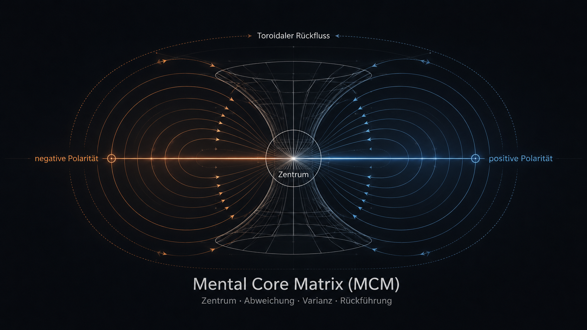
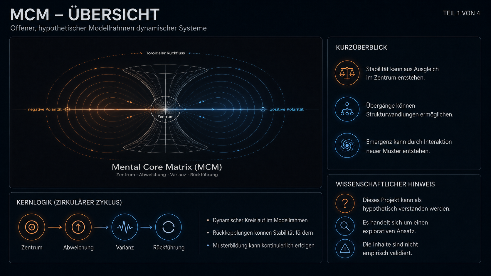
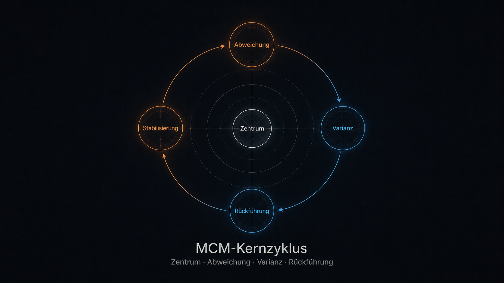
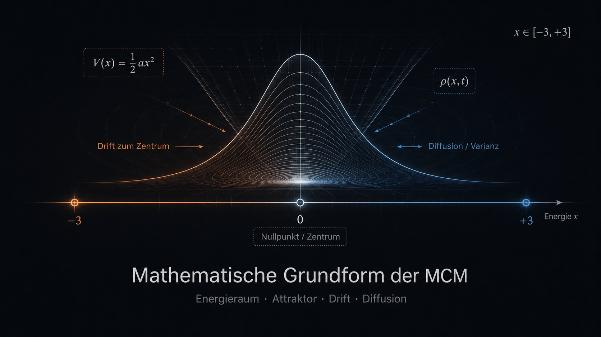
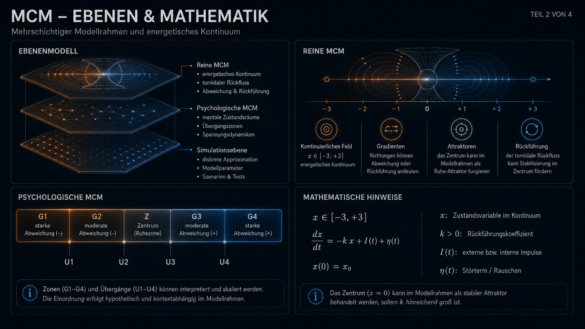
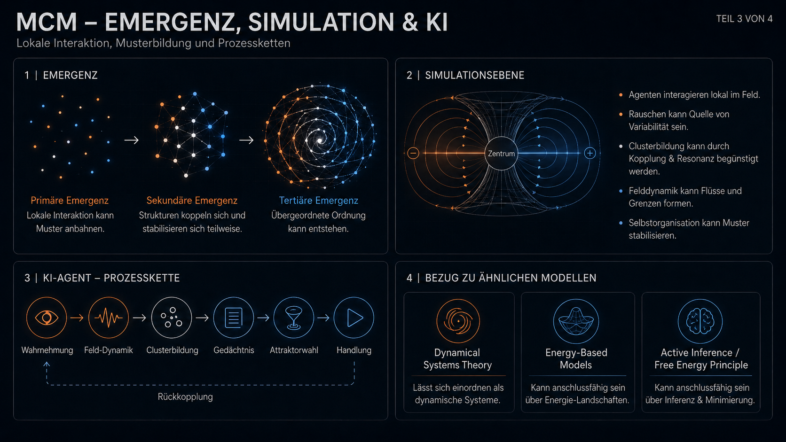
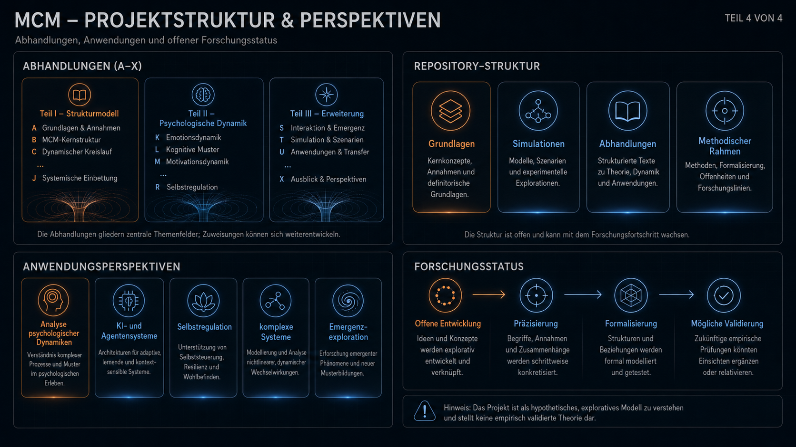
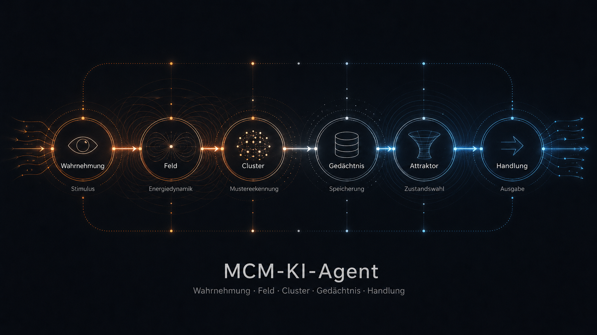

# Mental Core Matrix (MCM)

> Ein offenes, hypothetisches Forschungsprojekt zur Untersuchung dynamischer Systeme mit Fokus auf Struktur, Rückführung und emergente Ordnungsbildung.

---

## Kurzüberblick

Die **Mental Core Matrix (MCM)** kann als konzeptioneller Modellrahmen betrachtet werden, mit dem untersucht werden kann, wie dynamische Systeme:

- Stabilität ausbilden  
- in Veränderung übergehen  
- neue Zustände (Varianz) hervorbringen  
- und über Rückführung wieder zu Ordnung oder neuer Stabilisierung gelangen  

Das Modell wird als **offener Forschungsansatz** verstanden und dient der strukturierten Exploration komplexer Dynamiken.

---

## Worum es in der MCM geht

Im Rahmen dieses hypothetischen Modells wird angenommen, dass sich viele dynamische Systeme entlang wiederkehrender Funktionsbereiche beschreiben lassen:

1. **Zentrum**  
   Referenzpunkt eines Systems, interpretierbar als stabilisierende oder ausgleichende Struktur  

2. **Abweichung**  
   Bewegung weg vom Zentrum, z. B. durch Störung, Impuls oder Spannungsaufbau  

3. **Varianz**  
   Bereich möglicher Zustände, in dem neue Muster, Strategien oder Strukturen entstehen können  

4. **Rückführung**  
   Prozesse, durch die Zustände integriert, stabilisiert oder neu organisiert werden  

Diese vier Bereiche können als **dynamischer Zyklus mit Rückkopplungen** interpretiert werden.

---

## Kernlogik

Vereinfachte Darstellung:

`Zentrum → Abweichung → Varianz → Rückführung`

Innerhalb dieses Zyklus können folgende Dynamiken auftreten:

- Attraktorbildung  
- Oszillation zwischen Zuständen  
- lokale Instabilitäten und Übergänge  
- adaptive Stabilisierung  
- Emergenz neuer Muster  

Die Struktur kann als Hinweis auf generische Prinzipien dynamischer Systeme interpretiert werden.

---
## Mathematische Grundform

---
## Projektprinzip (Emergenz und Ordnungsbildung)

Ein zentraler Leitgedanke dieses Projekts liegt in der Untersuchung von **Emergenz** innerhalb eines dynamischen Spannungsraums.

Im Fokus stehen:

- Selbstorganisation durch lokale Wechselwirkungen  
- Bildung stabiler und semistabiler Zustände (Attraktoren)  
- Übergänge zwischen Zuständen (Transitionsräume)  
- Rückkopplungsprozesse und Regulation  
- mögliche Übertragbarkeit auf unterschiedliche Systemtypen (KI)

Das Modell eröffnet die Möglichkeit, zu untersuchen, wie aus einfachen Interaktionen komplexe Ordnungsstrukturen entstehen können.

---

## Abhandlungen (A–X Struktur)

Die vollständige theoretische Ausarbeitung liegt in eigenständigen Abhandlungen vor.

### Teil I – Strukturmodell

- [A – MCM und die Frage nach dem Ursprung](<Abhandlungen/MCM - Hauptabhandlungen/Teil I - Die Mental Core Matrix – Strukturmodell/Abhandlung Block A - MCM und die Frage nach dem Ursprung.pdf>)  
- [B – Die Mental Core Matrix als mögliches Ordnungsprinzip](<Abhandlungen/MCM - Hauptabhandlungen/Teil I - Die Mental Core Matrix – Strukturmodell/Abhandlung Block B - MCM als universelles Ordnungsprinzip.pdf>)  
- [C – Die energetische Evolution des Menschen](<Abhandlungen/MCM - Hauptabhandlungen/Teil I - Die Mental Core Matrix – Strukturmodell/Abhandlung Block C - Die energetische Evolutuion des Menschen.pdf>)  
- [D – Die energetische Natur der Zeit](<Abhandlungen/MCM - Hauptabhandlungen/Teil I - Die Mental Core Matrix – Strukturmodell/Abhandlung Block D - Die energetische Natur der Zeit.pdf>)  
- [E – Die kosmische Matrix](<Abhandlungen/MCM - Hauptabhandlungen/Teil I - Die Mental Core Matrix – Strukturmodell/Abhandlung Block E - Die kosmische Matrix.pdf>)  
   - [E.1 – Die polare Entstehung des Universums](<Abhandlungen/MCM - Hauptabhandlungen/Teil I - Die Mental Core Matrix – Strukturmodell/Abhandlung Block E.1 - Die polare Entstehung des Universums.pdf>)
- [F – Bewusstsein als möglicher Attraktor](<Abhandlungen/MCM - Hauptabhandlungen/Teil I - Die Mental Core Matrix – Strukturmodell/Abhandlung Block F - Bewusstsein als kosmischer Attraktor.pdf>)  
- [G – Die Multiversen-Matrix](<Abhandlungen/MCM - Hauptabhandlungen/Teil I - Die Mental Core Matrix – Strukturmodell/Abhandlung Block G - Die Multiversen-Matrix.pdf>)  
   - [G.1 – Erweiterungsblock: Reorganisation verdichteter Energie](<Abhandlungen/MCM - Hauptabhandlungen/Teil I - Die Mental Core Matrix – Strukturmodell/Abhandlung Block G.1 - Reorganisation verdichteter Energie in einen übergeordneten Feldbereich.pdf>)
- [H – MCM und die Dynamik der Individualität](<Abhandlungen/MCM - Hauptabhandlungen/Teil I - Die Mental Core Matrix – Strukturmodell/Abhandlung Block H - MCM und das Phänomen der Individualität.pdf>)  
- [I – MCM und evolutionäre Prozesse](<Abhandlungen/MCM - Hauptabhandlungen/Teil I - Die Mental Core Matrix – Strukturmodell/Abhandlung Block I - MCM und die Dynamik evolutionärer Prozesse.pdf>)  

---

### Teil II – Psychologische Dynamik

- [J – Die menschliche Psyche im Modell](<Abhandlungen/MCM - Hauptabhandlungen/Teil II - Psychologische Dynamik der Mental Core Matrix/Abhandlung Block J - Die menschliche Psyche im Modell der Mental Core Matrix.pdf>)  
- [K – Individuelle Selbstregulation](<Abhandlungen/MCM - Hauptabhandlungen/Teil II - Psychologische Dynamik der Mental Core Matrix/Abhandlung Block K - Individuelle Selbstregulation im Modell der Mental Core Matrix.pdf>)  
- [L – Soziale Dynamik](<Abhandlungen/MCM - Hauptabhandlungen/Teil II - Psychologische Dynamik der Mental Core Matrix/Abhandlung Block L- Soziale Dynamik im Modell der Mental Core Matrix.pdf>)  
- [M – Die MCM und das Selbst](<Abhandlungen/MCM - Hauptabhandlungen/Teil II - Psychologische Dynamik der Mental Core Matrix/Abhandlung Block M - die MCM und das Selbst.pdf>)  
- [N – Trauma und Musterstörungen](<Abhandlungen/MCM - Hauptabhandlungen/Teil II - Psychologische Dynamik der Mental Core Matrix/Abhandlung Block N - Trauma und extreme Musterstörungen im energetischen System.pdf>)  
- [O – Kreativität](<Abhandlungen/MCM - Hauptabhandlungen/Teil II - Psychologische Dynamik der Mental Core Matrix/Abhandlung Block O - Kreativität im Modell der Mental Core Matrix.pdf>)  
- [P – Angst](<Abhandlungen/MCM - Hauptabhandlungen/Teil II - Psychologische Dynamik der Mental Core Matrix/Abhandlung Block P - Angst im Modell der Mental Core Matrix.pdf>)  
- [Q – Aggression](<Abhandlungen/MCM - Hauptabhandlungen/Teil II - Psychologische Dynamik der Mental Core Matrix/Abhandlung Block Q - Aggression im Modell der Mental Core Matrix.pdf>)  
- [R – Depression](<Abhandlungen/MCM - Hauptabhandlungen/Teil II - Psychologische Dynamik der Mental Core Matrix/Abhandlung Block R - Depression im Modell der Mental Core Matrix.pdf>)  
- [S – Metaregulatoren](<Abhandlungen/MCM - Hauptabhandlungen/Teil II - Psychologische Dynamik der Mental Core Matrix/Abhandlung Block S - Mögliche Metaregulatoren im Modell der Mental Core Matrix.pdf>)  

---

### Teil III – Erweiterung des Modells

- [T – Strukturmodell komplexer Systeme](<Abhandlungen/MCM - Hauptabhandlungen/Teil III - Zusammenführung des Modells/Abhandlung Block T - Die Mental Core Matrix als mögliches Strukturmodell komplexer Systeme.pdf>)  
- [U – Reine MCM (archetypenfreie Ebene)](<Abhandlungen/MCM - Hauptabhandlungen/Teil III - Zusammenführung des Modells/Abhandlung Block U - Die reine Form der MCM und die Möglichkeit zur Transzendenz.pdf>)  
- [V – MCM und KI-Systeme](<Abhandlungen/MCM - Hauptabhandlungen/Teil III - Zusammenführung des Modells/Abhandlung Block V - Die Mental Core Matrix und die Frage, ob eine KI die starre Logik bricht.pdf>)  
- [W – Übergang zwischen Logik und physischer Dynamik](<Abhandlungen/MCM - Hauptabhandlungen/Teil III - Zusammenführung des Modells/Abhandlung Block W - Die Mental Core Matrix zwischen Logik und dem Bruch in ein physisches System.pdf>)  
- [X – MCM als mögliches Feldsystem](<Abhandlungen/MCM - Hauptabhandlungen/Teil III - Zusammenführung des Modells/Abhandlung Block X - Die Mental Core Matrix als physisches Feldsystem.pdf>)  

---

## Modellstruktur (Ebenen)

Die MCM kann als mehrschichtiger Modellrahmen betrachtet werden:

### 1. Reine MCM (energetische Ebene)

- kontinuierliches Spannungsfeld  
- keine Kategorien oder Archetypen  
- Dynamik durch Gradienten, Flüsse und Attraktoren  
- Grundlage für Emergenz  

### 2. Psychologische MCM (Interpretationsebene)

- Projektion des Energieraums in semantische Kategorien  
- Archetypen als interpretative Muster  
- Anwendung auf Verhalten, Emotion und Kognition  

### 3. Simulationsebene

- agentenbasierte Modelle  
- stochastische Prozesse  
- Clusterbildung und Felddynamik  
- Untersuchung emergenter Strukturen  

Diese Ebenen können gemeinsam betrachtet werden, bleiben jedoch analytisch getrennt.

---

## MCM Projektstruktur, Zusammenfassung!

---

## MCM KI Agenten Entwicklung

Im Rahmen der MCM könnte ein Agent nicht nur als System betrachtet werden, das binäre Zustände wie 0 und 1 verarbeitet, sondern als DIO – ein digitaler Organismus.

Ein solcher DIO könnte über eine eigene innere und äußere Wahrnehmung verfügen und auf dieser Grundlage eine eigene Syntax ausbilden, um seine Umwelt zu beschreiben, zu ordnen und zu interpretieren.

Aus neuronaler Sicht eröffnet sich damit ein spannender Forschungsweg:

Könnte ein DIO, der eine eigene Syntax entwickelt, mit anderen DIOs lernen, sich austauschen und auf kollektiver Ebene eine gemeinsame Kommunikationsform herausbilden?

---

## Bezug zu ähnlichen Modellen

Die MCM kann rückblickend in Bezug zu ähnlichen Modellfamilien gesetzt werden, ohne daraus abgeleitet worden zu sein. Besonders nahe Vergleichspunkte ergeben sich hypothetisch zu:

- **Dynamical Systems Theory**: Zustandsräume, Attraktoren, Übergänge und Phasenwechsel
- **Energy-Based Models**: Energiezustände, Stabilisierung und attraktorähnliches Verhalten
- **Active Inference / Free Energy Principle**: Selbstorganisation, Regulation und zustandsabhängige Anpassung

Diese Bezüge dienen nur der wissenschaftlichen Einordnung. Die MCM wurde *nicht!* aus diesen Ansätzen konstruiert, sondern entwickelte sich als eigenständige Strukturidee. Die nachträgliche Nähe zu solchen Modellen kann als Hinweis verstanden werden, dass ähnliche Grundprobleme berührt werden: Stabilisierung, Abweichung, Rückführung, lokale Wechselwirkung und emergente Ordnungsbildung.

Die Besonderheit der MCM liegt in der Kombination mehrerer Ebenen: einem Zentrum als regulativem Bezugspunkt, einem kontinuierlichen Spannungsraum, einer archetypenfreien energetischen Ebene, einer psychologischen Interpretationsebene und simulationsbasierter Emergenz durch lokale Kopplung, Rauschen, Dichtebildung und Clusterung.

*Damit kann die MCM eher als maschinell unterstützte Komplettierung einer eigenständig entstandenen Modellidee gelesen werden, nicht als Variante eines bestehenden Modells.*

---

## Methodischer Ansatz

Die Entwicklung des Modells basiert auf:

- Analyse dynamischer Systeme  
- Untersuchung von Attraktoren und Rückkopplungen  
- Simulation emergenter Prozesse  
- KI-gestützter Mustererkennung  

Diese Methoden dienen der Exploration möglicher Strukturen und ersetzen keine empirische Validierung.

---

## Repository-Struktur

Das Repository gliedert sich in mehrere Bereiche, die unterschiedliche Ebenen des Projekts abdecken.

### 1. Grundlagen der MCM

- [Psychologische MCM](<MCM – Mental Core Matrix/A - Psychologische Mental Core Matrix.pdf>)  
- [Reine MCM](<MCM – Mental Core Matrix/B - Reine MCM.pdf>)  
- [Relation zwischen psychologischer und reiner MCM](<MCM – Mental Core Matrix/C - MCM Relation .pdf>)  
- [Energetischer Bereich der MCM](<MCM – Mental Core Matrix/D - Erklärung - Energetischer Bereich der MCM.pdf>)  
- [Mathematische Grundform der psychologischen MCM](<MCM – Mental Core Matrix/AA - Mathematische Grundform der psychologischen MCM.pdf>)  
- [Mathematische Grundform der reinen MCM](<MCM – Mental Core Matrix/BB - Mathematische Grundform der reinen MCM.pdf>)  
- [Formale Gesamtstruktur der MCM](<MCM – Mental Core Matrix/CC- Formale Gesamtstruktur der MCM.pdf>)  

### 2. Hauptabhandlungen und Nebenabhandlungen

- [MCM Hauptabhandlungen A–X](<Abhandlungen/MCM - Hauptabhandlungen>)  
- [Anfang der MCM / The Last Supper](<Abhandlungen/Anfang der MCM>)  
- [MCM Nebenabhandlungen](<Abhandlungen/MCM - Nebenabhandlung>)  
- [Ausprägung des MCM-Systems](<Abhandlungen/Ausprägung des MCM-Systems.pdf>)  

### 3. Code-Beispiele und Simulationen

- [MCM KI Modell](<MCM - Code Beispiele/MCM KI Modell>)  
- [MCM Energie / BioLink / Agentenmodelle](<MCM - Code Beispiele/MCM - Energie BioLink etc>)  
- [MCM Emergenzsimulationen](<MCM - Code Beispiele/MCM - Emergenze>)  
- [MCM Infinity / Audio-Emergenz](<MCM - Code Beispiele/MCM - Infinity - Audio_Emergenz>)  
- [MCM Audio-Emergenz 3D 256](<MCM - Code Beispiele/MCM - Audio_Emergenz_3d_256>)  
- [Simulationen der MCM – Überblick](<MCM - Code Beispiele/Simulationen der MCM – Mental Core Matrix.pdf>)  
- [Hypothetische Entwicklungsanalyse einer MCM-basierten KI](<MCM - Code Beispiele/Hypothetische Entwicklungsanalyse einer MCM-basierten KI.pdf>)  

### 4. Visualisierungen und Medien

- [README-Bilder und Strukturdiagramme](<files>)  
- [Audio-Exporte der MCM-Infinity-Simulation](<MCM - Code Beispiele/MCM - Infinity - Audio_Emergenz/audio_exports>)  

### 5. Methodischer Rahmen

- [Projekt-Disclaimer und methodischer Rahmen](<Projekt-Disclaimer und methodischer Rahmen.pdf>)  

---

## Anwendungsperspektiven (hypothetisch)

Das Modell kann potenziell genutzt werden für:

- Analyse psychologischer Dynamiken  
- Modellierung von KI- und Agentensystemen  
- Untersuchung von Selbstregulation  
- Simulation komplexer Systeme  
- Exploration von Emergenzprozessen  

Diese Anwendungen sind als mögliche Interpretationen innerhalb des Modells zu verstehen.

---

## Wissenschaftlicher Hinweis

Die Mental Core Matrix wird als **hypothetisches Strukturmodell** verstanden.

Die dargestellten Inhalte umfassen:

- theoretische Annahmen  
- explorative Modelle  
- simulationsbasierte Strukturversuche  
- nicht empirisch validierte Ansätze  
- keine abgeschlossene wissenschaftliche Theorie  

Das Modell dient dazu:

- strukturelle Muster sichtbar zu machen  
- neue Forschungsfragen zu formulieren  
- mögliche Verbindungen zwischen Disziplinen zu untersuchen  
- emergente Ordnungsbildung in abstrahierten Zustandsräumen explorativ zu simulieren  

Die MCM erhebt keinen Anspruch, etablierte Modelle zu ersetzen. Sie kann als eigenständiger, offener Modellrahmen betrachtet werden, der Anschlussstellen zu ähnlichen dynamischen, energetischen und selbstorganisierenden Ansätzen besitzt.  

---

## Forschungsstatus

Das Projekt befindet sich in einem offenen Entwicklungszustand.

Die Inhalte können:

- erweitert  
- präzisiert  
- mathematisch formalisiert  
- oder angepasst werden  

Die MCM wird als fortlaufender Forschungsprozess verstanden.

---

## Kurzfassung

Die Mental Core Matrix (MCM) kann als hypothetischer Modellrahmen zur Beschreibung dynamischer Systeme über die Bereiche Zentrum, Abweichung, Varianz und Rückführung betrachtet werden.  
Im Fokus steht die Untersuchung von Emergenz, Selbstorganisation und Stabilisierung.  
Das Projekt verbindet konzeptionelle, mathematische und simulationsbasierte Ansätze und wird als offenes Forschungsmodell geführt.